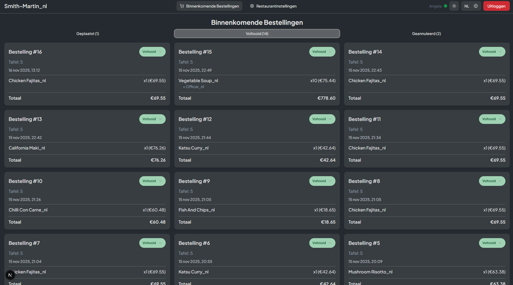

# QR Restaurant Ordering system

Stack: Next.js - Django - Tailwind - ShadCN

Work In Progress

# TODO
- Django channels require asgi uvicorn to run. But in development, this disabled static file serving and does not style the /admin in dev mode. But it does work in production.
- DuckDNS does not work